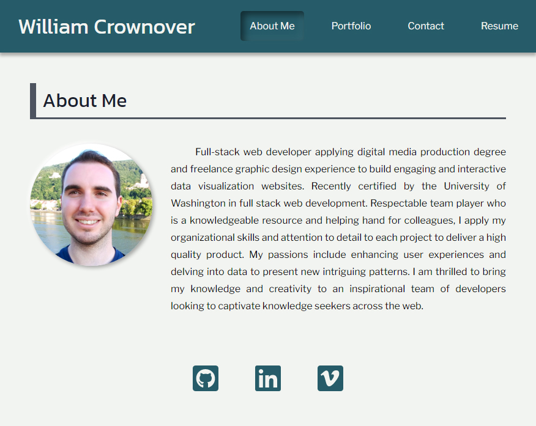

# William Crownover’s React Portfolio

## Description

This is my web development portfolio build as a single-page application using React.js. My site breaks down the content into conditionally rendered “pages” for about me, portfolio , contact, and resume. You can visit six of my top projects from the portfolio section which use a wide range of web technologies. If you like what you see, feel free to reach out to me for more info or collaboration opportunities!

## Table of Contents

- [Live Site](#live-site)
- [Technologies](#technologies)
- [Future Development](#future-development)
- [License](#license)
- [Contact](#contact)

## Live Site

https://williamcrownover.github.io/react-portfolio/

## Technologies

- React.js
- Single-page App
- Conditional Rendering
- useState
- Components
- JSX Expressions
- Event Handling

## Future Development

I will be updating my portfolio on a regular basis to include my feature projects.

## License

Licensed under the MIT License - https://opensource.org/licenses/MIT

## Contact

If you have any questions you can email me at williamcrownover1@gmail.com.

You can also check out my other work on GitHub at [WilliamCrownover](https://github.com/WilliamCrownover)

